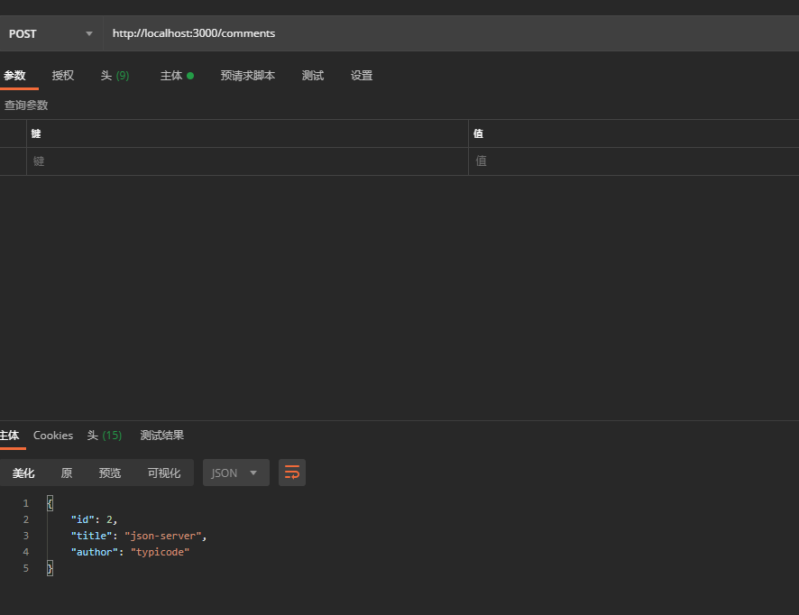

 **为需要快速后端进行原型设计和模拟的前端开发人员创建** 

还在mockjson 吗? 其实还有更简单的方式 确实只需要30秒  一首歌的时间都不到

1 安装依赖

```
npm install -g json-server
```

2  建立db.json

```


{
  "posts": [
    { "id": 1, "title": "json-server", "author": "typicode" }
  ],
  "comments": [
    { "id": 1, "body": "some comment", "postId": 1 }
  ],
  "profile": { "name": "typicode" }
}
```

3启动服务

```
json-server --watch db.json
```

4使用服务

```
http://localhost:3000/posts/1
```

结束了 就是这么快

效果如下



增删改查路径

```
GET    /posts
GET    /posts/1
POST   /posts
PUT    /posts/1
PATCH  /posts/1
DELETE /posts/1
```

